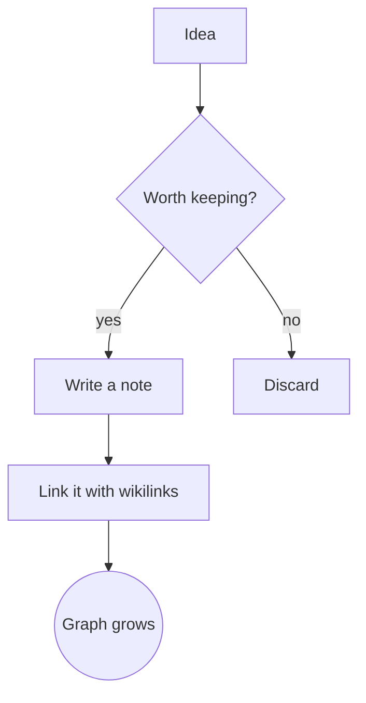
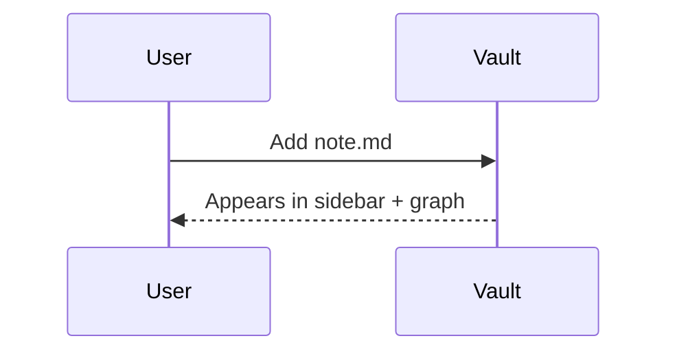

# Flow Diagram

Flow diagrams use a `mermaid` fenced block:

```mermaid
flowchart TD
  A[Idea] --> B{Worth keeping?}
  B -- yes --> C[Write a note]
  B -- no --> D[Discard]
  C --> E[Link it with wikilinks]
  E --> F((Graph grows))
```

Sequence diagrams, state machines and more are supported too:

```mermaid
sequenceDiagram
  User->>Vault: Add note.md
  Vault-->>User: Appears in sidebar + graph
```

Back to [[Welcome]].

#demo
